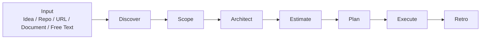
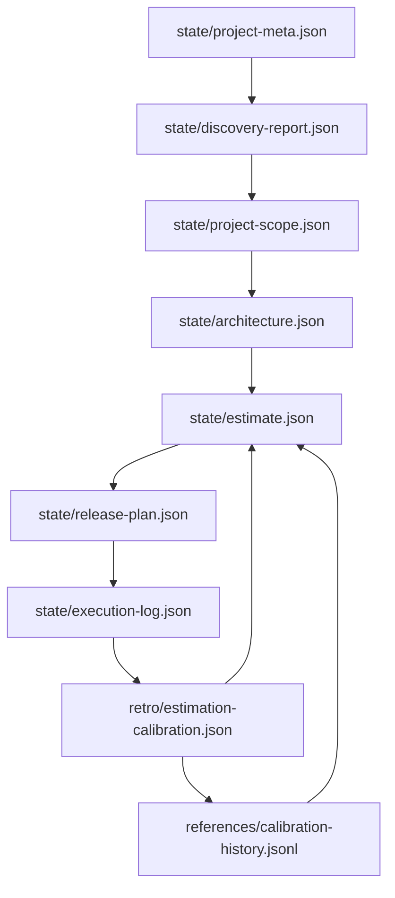
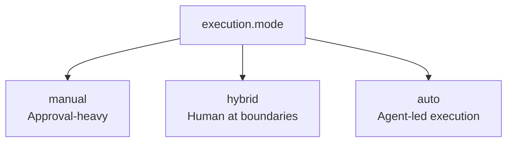
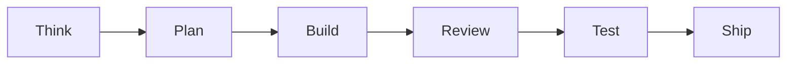

# Project Management Skills

Provider-aware project management skills for AI coding agents.

This repository packages a structured project delivery workflow that can take a raw idea, repository, document, or existing product and turn it into:

- discovery outputs
- scoped requirements
- technical architecture
- provider-aware estimates
- planning documents
- executable release plans
- delivery telemetry
- retrospective calibration data

It is designed for skill-based agent systems such as Codex and OpenCode, where the agent can either guide a human through the workflow or run large parts of it end to end.

## What This Repository Does

The repository contains an orchestrator skill plus phase-specific sub-skills for a seven-step project lifecycle:

1. Discover the project context and current reality
2. Scope the work and define boundaries
3. Design the architecture
4. Estimate effort, tokens, time, and cost
5. Generate planning artifacts
6. Execute work in a controlled delivery loop
7. Run a retrospective and calibrate future estimates

The system supports:

- multiple AI providers
- provider/model tier mapping
- manual, hybrid, and automatic execution modes
- machine-readable state handoffs between phases
- telemetry-aware retrospectives

## Repository Structure

```text
.
├── SKILL.md                         # Main orchestrator skill
├── install.sh                       # Installer with Claude Code integration
├── config/
│   └── pipeline-config.json         # Provider, execution, and pipeline defaults
├── references/
│   ├── estimation-benchmarks.json   # Provider-aware estimation benchmarks
│   ├── calibration-history.jsonl    # Cross-project calibration history
│   ├── interview-guide.md           # Discovery interview prompts
│   ├── pbi-template.md              # Product backlog item template
│   ├── test-case-template.md        # Test case template
│   └── doc-templates/               # Generated document templates
└── skills/
    ├── discover/
    ├── scope/
    ├── architect/
    ├── estimate/
    ├── plan/
    ├── execute/
    └── retro/
```

## Core Workflow



## State Flow

Each phase writes structured outputs that the next phase can consume.



## Execution Modes

The workflow can be run in three styles depending on how much control the human wants to keep:



- `manual`: best for collaborative planning, reviews, and strict approval gates
- `hybrid`: best default for most projects; humans approve key transitions and the agent moves inside the boundaries
- `auto`: best for end-to-end execution where the agent should proceed unless blocked

## Provider-Aware Estimation

The estimation layer is designed to work across multiple providers instead of assuming a single vendor. It estimates by:

- work item
- complexity
- risk
- model tier
- provider-specific model mapping
- token and time budgets
- telemetry quality

This allows the workflow to remain usable even when the underlying model provider changes.

## Typical Use Cases

- Turning a rough product idea into a full delivery plan
- Breaking down an existing repository into requirements and work items
- Producing architecture and planning documentation for a client or internal team
- Estimating AI-assisted delivery cost and timeline before implementation starts
- Running a structured agent execution loop with machine-readable handoffs
- Capturing delivery telemetry and improving future estimates
- Building cross-project calibration data that makes each subsequent project more accurate

## Installation

### Claude Code

Run the installer:

```sh
./install.sh
```

This will:
1. Validate that all required skill files are present
2. Detect your Claude Code environment (`~/.claude/`)
3. Symlink the skill into `~/.claude/commands/` as a custom slash command
4. Optionally configure your default provider (openai or anthropic)
5. Run post-install verification (symlink validity, JSON validation)

After installation, invoke the skill in Claude Code with `/project-management-skills`.

### OpenCode

Symlink the repository into the OpenCode skills directory:

```sh
ln -s /path/to/project-management-skills \
  ~/.config/opencode/skills/project-management-skills
```

If OpenCode is already running, restart it so the new skill is reloaded.

### Codex-Style Skill Environments

If your agent environment supports a `skills/` directory with `SKILL.md` entrypoints, copy or symlink this repository into that skill root and ensure the main entrypoint is visible.

## How to Invoke It

The orchestrator is intended for prompts such as:

- `Plan this project`
- `Discover this repo and estimate the work`
- `Scope this feature set`
- `Generate PBIs and test cases`
- `Run the full project-builder workflow`
- `Execute this release plan in hybrid mode`

The main orchestrator lives in [SKILL.md](/Users/gurkanozkan/emdash-projects/project-management-skills/SKILL.md).

## Phase Summary

| Phase | Purpose | Main Output |
|---|---|---|
| Discover | Understand the project and gather facts | `state/discovery-report.json` |
| Scope | Define requirements and boundaries | `state/project-scope.json` |
| Architect | Design technical structure and flows | `state/architecture.json` |
| Estimate | Project time, cost, tokens, and model fit | `state/estimate.json` |
| Plan | Generate documentation and release planning | `docs/*`, `state/release-plan.json` |
| Execute | Run work items through delivery stages with budget burn tracking | `state/execution-log.json` |
| Retro | Compare estimates vs actuals, calibrate per work type and provider | `retro/retro-report.json`, `retro/estimation-calibration.json` |

## Delivery Loop



Each stage has defined responsibilities: THINK identifies the approach, PLAN breaks it into sub-steps, BUILD writes the code, REVIEW checks against acceptance criteria, TEST captures pass/fail counts, and SHIP records telemetry and unblocks downstream items.

The execution phase tracks budget burn (tokens, cost, time) after every work item. If any dimension exceeds 80% with work remaining, a warning is raised.

## Why This Exists

Most agent workflows are strong at isolated tasks but weak at project-level continuity. This repository exists to add:

- structured phase transitions
- reusable planning artifacts
- traceability across requirements, PBIs, tests, and work items
- explicit execution modes
- provider-aware estimation
- budget burn tracking with early warning thresholds
- retrospective learning with per-work-type and per-provider calibration
- cross-project calibration history that improves estimates over time

## Current Status

This repository is an evolving skill package, not a standalone application. The value is in the workflow design, structured outputs, and agent instructions.
