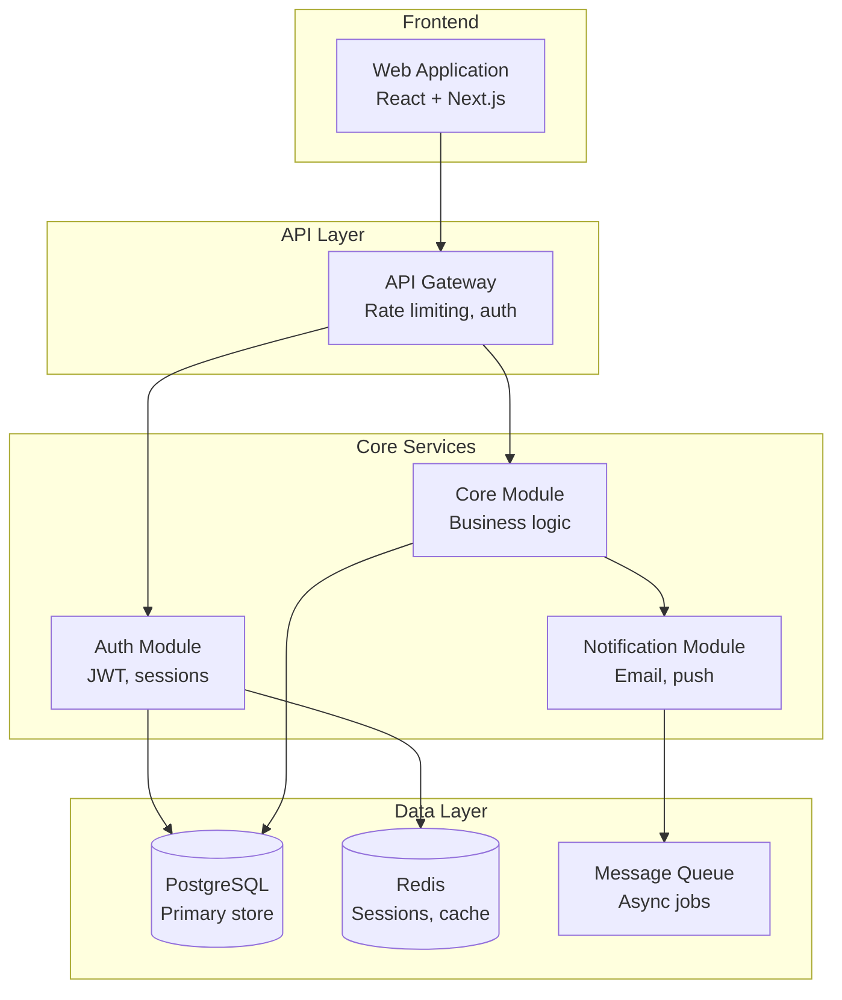
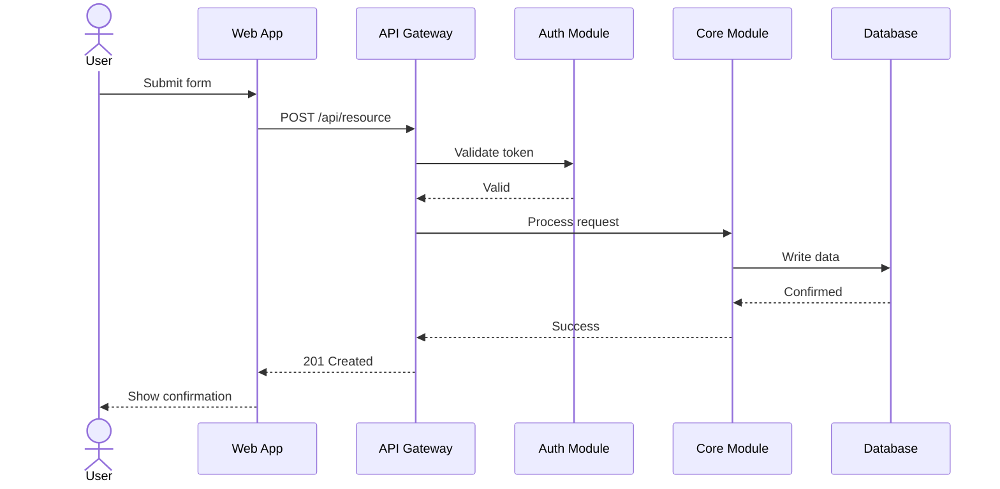

# Phase 2: Technical Architecture

Design the system before building it. This phase transforms scoped requirements into a technical blueprint that guides implementation.

## Prerequisites

Read `state/project-scope.json` and `state/discovery-report.json`. You need:
- Requirements list (with priorities and business rules)
- Tech stack (from discovery or user input)
- Scope boundary (what's in v1)
- Constraints (performance, compliance, infrastructure)

If these don't exist, ask the user to provide context or run earlier phases.

## Step 1: Architecture Style Selection

Based on the requirements and constraints, recommend an architecture style. Present the reasoning — don't just pick one.

### Decision Framework

| Factor | Monolith | Modular Monolith | Microservices | Serverless |
|---|---|---|---|---|
| Team size | 1-5 | 3-10 | 10+ | 1-5 |
| Deployment complexity ok? | Low | Low | High | Medium |
| Independent scaling needed? | No | Some | Yes | Yes |
| Time to first deploy | Fast | Fast | Slow | Fast |
| Operational overhead | Low | Low | High | Low-Medium |

For most new projects with small teams, recommend **Modular Monolith** — it gives you clean boundaries without microservice overhead, and can be split later when needed.

Present your recommendation with reasoning:

```
ARCHITECTURE RECOMMENDATION
━━━━━━━━━━━━━━━━━━━━━━━━━━

Recommended: Modular Monolith
Reasoning:
  • Team of 2 — microservices overhead not justified
  • Clear module boundaries (auth, core, billing)
  • Can extract services later if needed
  • Simpler deployment and debugging

Alternative considered: Serverless
  • Would work for the API, but the real-time features need persistent connections
```

Get user agreement before proceeding with the architecture design.

## Step 2: Component Decomposition

Break the system into components. Each component should:
- Own a clear responsibility (single concern)
- Have well-defined inputs and outputs
- Map to one or more requirements

### Component Definition

For each component:

```
COMPONENT: {ComponentName}
  Responsibility: {What it does — one sentence}
  Requirements: {REQ-IDs it satisfies}
  Inputs: {What it receives and from where}
  Outputs: {What it produces and to where}
  Dependencies: {Other components it needs}
  Data owned: {What data this component is the source of truth for}
  Tech choice: {Specific tech if applicable — e.g., "Redis for session store"}
```

### Component Diagram (Mermaid)

Generate a Mermaid component diagram and save to `diagrams/component.mermaid`:



Adapt the diagram to the actual project. The diagram should be readable at a glance — if it's too complex, split into sub-diagrams.

## Step 3: API Contract Design

For each component boundary that has an API (external or internal), define:

```
ENDPOINT: {METHOD} {path}
  Purpose: {What it does}
  Requirements: {REQ-IDs}
  Request:
    Headers: {required headers}
    Body: {schema or example}
    Validation: {rules}
  Response:
    Success (200): {schema}
    Error (4xx): {error codes and meanings}
    Error (5xx): {what could go wrong}
  Auth: {required | optional | none}
  Rate limit: {if applicable}
```

Group endpoints by component/resource. For REST APIs, follow resource-oriented design. For GraphQL, define types and resolvers. For event-driven systems, define event schemas.

## Step 4: Data Model

Define the core data entities and their relationships:

```
ENTITY: {EntityName}
  Fields:
    - id: UUID (PK)
    - {field}: {type} {constraints}
    - created_at: timestamp
    - updated_at: timestamp
  Relationships:
    - belongs_to: {OtherEntity} (FK: other_entity_id)
    - has_many: {OtherEntity}
  Indexes:
    - {field} (for: query by field)
    - {field1, field2} (for: composite lookup)
  Business rules:
    - {data-level rules, e.g., "status can only transition forward"}
```

Generate an ER diagram in Mermaid and save to `diagrams/data-model.mermaid`.

## Step 5: Sequence Diagrams

For the 3-5 most critical user flows, create sequence diagrams showing how components interact. Save to `diagrams/sequence-{flow-name}.mermaid`.

Pick the flows that are:
- Most complex (many components involved)
- Most critical (core business value)
- Most risky (failure here is costly)



## Step 6: Edge Cases & Failure Modes

This is where architecture gets real. For each component and each critical flow, systematically identify:

### Failure Mode Analysis

| Component | Failure Mode | Impact | Detection | Mitigation |
|---|---|---|---|---|
| Database | Connection lost | All writes fail | Health check | Connection pool retry + circuit breaker |
| Auth | Token service down | No new logins | Error rate spike | Cached token validation, graceful degradation |
| Queue | Messages backed up | Delays in async ops | Queue depth metric | Auto-scaling consumers, dead letter queue |

### Edge Cases by Category

1. **Concurrency** — What happens with simultaneous requests? Race conditions? Optimistic locking needed?
2. **Data integrity** — Partial writes? Orphaned records? Cascading deletes?
3. **Scale boundaries** — What breaks at 10x, 100x current load?
4. **Network** — Timeout handling? Retry strategy? Idempotency?
5. **Security** — Auth bypass paths? Injection points? Data exposure?
6. **Backwards compatibility** — API versioning? Schema migration? Client compatibility?

## Step 7: Test Matrix

Map requirements to testing strategy:

| Requirement | Unit Tests | Integration Tests | E2E Tests | Performance Tests |
|---|---|---|---|---|
| REQ-001: Auth | Login logic, token validation | Auth + DB, Auth + Cache | Full login flow | 1000 concurrent logins |
| REQ-002: CRUD | Business rule validation | API + DB roundtrip | Create-read-update-delete cycle | Bulk operations |

Identify what CANNOT be easily tested and flag it — these are risk areas.

## Output: architecture.json

Save to `state/architecture.json`:

```json
{
  "phase": "architect",
  "status": "DONE",
  "timestamp": "2026-03-20T12:00:00Z",
  "architecture_style": "modular_monolith",
  "architecture_rationale": "Small team, clear module boundaries, can extract services later",
  "components": [
    {
      "name": "AuthModule",
      "responsibility": "Authentication and authorization",
      "requirements": ["REQ-001", "REQ-010"],
      "dependencies": ["Database", "Cache"],
      "data_owned": ["users", "sessions", "roles"],
      "tech": "JWT + bcrypt + Redis sessions",
      "api_endpoints": 5,
      "complexity": "medium"
    }
  ],
  "data_entities": [
    {
      "name": "User",
      "fields": ["id", "email", "password_hash", "role", "created_at"],
      "relationships": ["has_many: Sessions", "has_many: Resources"],
      "estimated_row_count": "10K-100K"
    }
  ],
  "critical_flows": [
    {
      "name": "User Authentication",
      "components_involved": ["WebApp", "APIGateway", "AuthModule", "Database", "Cache"],
      "diagram": "diagrams/sequence-auth.mermaid",
      "complexity": "medium"
    }
  ],
  "failure_modes": [
    {
      "component": "Database",
      "mode": "Connection pool exhausted",
      "impact": "high",
      "mitigation": "Pool size monitoring + auto-scaling"
    }
  ],
  "edge_cases": [
    {
      "category": "concurrency",
      "description": "Simultaneous resource updates",
      "mitigation": "Optimistic locking with version field"
    }
  ],
  "test_strategy": {
    "unit_coverage_target": "80%",
    "integration_tests": ["auth flow", "CRUD operations", "payment flow"],
    "e2e_tests": ["core user journey", "admin workflow"],
    "performance_tests": ["concurrent auth", "bulk data operations"]
  },
  "diagrams_generated": [
    "diagrams/component.mermaid",
    "diagrams/data-model.mermaid",
    "diagrams/sequence-auth.mermaid",
    "diagrams/sequence-core-flow.mermaid"
  ],
  "open_decisions": [
    {
      "decision": "Message queue choice",
      "options": ["RabbitMQ", "Redis Streams", "SQS"],
      "recommendation": "Redis Streams — already using Redis, simpler ops",
      "impact": "Affects async processing architecture"
    }
  ]
}
```

## Phase Completion

```
ARCHITECTURE COMPLETE — {project_name}
━━━━━━━━━━━━━━━━━━━━━━━━━━━━━━━━━━━━

Style: {architecture_style}
Components: {count}
API Endpoints: {count}
Data Entities: {count}
Diagrams: {count} generated

Critical Flows Mapped: {count}
Failure Modes Identified: {count}
Edge Cases Documented: {count}
Open Decisions: {count}

Status: {DONE | DONE_WITH_CONCERNS | NEEDS_CONTEXT | BLOCKED}

Ready to proceed to Phase 3 (Estimation)?
```
